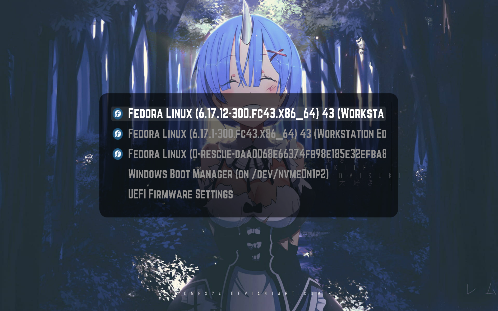

# Anime GRUB Theme

A modern, lightweight & minimal anime-inspired GRUB bootloader theme with multiple cool-looking variants.

## Previews




## Structure

- `base/` - Base theme template with all assets (fonts, icons, UI elements)
- `variants/` - Background images for different theme variants
- `VERSION` - Version file for tracking releases (semantic versioning: MAJOR.MINOR.PATCH)
- `themes/` - **Auto-generated** theme variants (local only, not committed)
- `releases/` - **Auto-generated** zip archives (local only, published to GitHub Releases)

## How It Works

This project uses an automated workflow (GitHub Actions) to generate theme variants and publish them as releases:

1. **Base Theme** (`base/`) contains the core theme assets and `theme.txt` configuration
2. **Variant Images** (`variants/`) contain background images (jpg, jpeg, or png)
3. **Generated Themes** are automatically created by combining the base theme with each variant image
4. **Zip Archives** are created for each theme variant
5. **GitHub Releases** are automatically created/updated with all theme zip files

When you push changes to the `main` branch that affect:
- Files in `base/`
- Files in `variants/`
- The `VERSION` file
- The generation script or workflow

GitHub Actions will automatically:
1. Generate all theme variants
2. Create zip archives for each theme
3. Create or update a GitHub Release (tagged with version from `VERSION` file)
4. Upload all theme zip files as release assets

### Versioning

The project uses semantic versioning (MAJOR.MINOR.PATCH) stored in the `VERSION` file:
- Update `VERSION` before pushing changes to create a new release
- If `VERSION` doesn't change, the existing release will be updated with new assets
- Releases are tagged as `v{VERSION}` (e.g., `v1.0.0`)

### Manual Generation

To generate themes and zip files locally:

```bash
./generate-themes.sh
```

This will:
- Create a theme folder for each image in `variants/`
- Copy all base assets to each theme
- Update `theme.txt` to use the variant's background image
- Create zip archives in `releases/` directory
- Clean up themes for removed variants

**Note:** Generated files (`themes/` and `releases/`) are in `.gitignore` and won't be committed.

## Download & Installation

### Download Themes

Download ready-to-use theme zip files from the [Releases](https://github.com/xandemon/anime-grub-theme/releases) page.

Each release contains:
- Individual zip files for each theme variant
- All assets needed for installation

### Installation

1. Download your preferred theme zip file from the [Releases](https://github.com/xandemon/anime-grub-theme/releases) page
2. Extract the zip file
3. Follow your distribution's GRUB theme installation instructions

## Adding New Variants

1. Add your background image to `variants/` (jpg, jpeg, or png)
2. Update `VERSION` file if you want a new release version
3. Push to `main` branch
4. GitHub Actions will automatically generate themes and create/update a release

> Run `./generate-themes.sh` locally to test before pushing.

---

Originally inspired from [DedSec Grub Theme by VandalByte](https://www.pling.com/p/1569525)